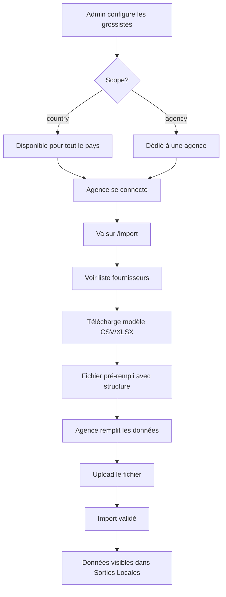

# 📋 Résumé des corrections - Module Import

## Problème initial

Dans la page `/import`, le fichier modèle téléchargé :
- ❌ Contenait tous les fournisseurs (pas de filtrage)
- ❌ Avait une structure différente de "Sorties Locales"
- ❌ Pas de colonnes Total
- ❌ Pas de ligne Total

## Solutions appliquées

### ✅ 1. Filtrage des fournisseurs par agence

**Logique de filtrage :**
- **Scope "country"** : Fournisseur disponible pour tout le pays
- **Scope "agency"** : Fournisseur dédié à une agence spécifique
- **Admin** : Voit tous les fournisseurs actifs

**Code :**
```typescript
for (const g of grossistes) {
  if (g.status === "blocked" || g.status === "inactive") continue;

  // Scope country : même pays
  if (g.scope === "country" && g.country === agencyInfo.country) {
    suppliers.add(g.partenaire);
  }

  // Scope agency : même agence
  if (g.scope === "agency" && g.agencyId === agencyInfo.id) {
    suppliers.add(g.partenaire);
  }
}
```

### ✅ 2. Structure identique à Sorties Locales

**En-têtes sur 2 lignes :**
```
Ligne 1 : Produit | CAMED |  |  | COPHARMED |  |  | Total |  |  |
Ligne 2 :         | Ventes | Stocks | Cmd | Ventes | Stocks | Cmd | Ventes | Stocks | Cmd |
```

**Corps du tableau :**
```
Produit | Ventes | Stocks | Cmd | ... | Total_V | Total_S | Total_C |
```

**Pied de tableau :**
```
TOTAL | Sum_V | Sum_S | Sum_C | ... | Global_V | Global_S | Global_C |
```

### ✅ 3. Interface utilisateur améliorée

**Bandeau informatif :**
- Liste des fournisseurs attribués (badges)
- Explication du filtrage
- Message d'avertissement si aucun fournisseur

**Instructions claires :**
- Structure sur 2 lignes d'en-têtes
- Colonnes Total automatiques
- Format identique à Sorties Locales

### ✅ 4. Synchronisation en temps réel

**Événements écoutés :**
- `datafuse:agencies` : Mise à jour des agences
- `datafuse:gros` : Mise à jour des grossistes

**Résultat :**
- La liste des fournisseurs se met à jour automatiquement
- Pas besoin de recharger la page

---

## Fichiers modifiés

### `src/routes/import.tsx`

#### 1. Imports ajoutés
```typescript
import { getAgencies, getGrossistes, getPanoramicProducts } from "@/lib/agencies";
```

#### 2. États ajoutés
```typescript
const [user, setUser] = useState<ReturnType<typeof getUser>>(null);
const [agencyInfo, setAgencyInfo] = useState<{ id: string; country: string } | null>(null);
```

#### 3. Logique de filtrage
```typescript
const agencySuppliers = useMemo(() => {
  const grossistes = getGrossistes();
  const suppliers = new Set<string>();

  // Filtrage selon scope + statut
  // ...

  return Array.from(suppliers).sort();
}, [agencyInfo]);
```

#### 4. Génération du modèle
```typescript
const templateData = useMemo(() => {
  // En-têtes sur 2 lignes
  const headerRow1 = ["Produit", ...fournisseurs, "Total"];
  const headerRow2 = ["", "Ventes", "Stocks", "Cmd", ..., "Ventes", "Stocks", "Cmd"];

  // Lignes de données avec totaux
  const dataRows = products.map(p => [
    `${p.name} (${p.cip})`,
    ...valeurs_par_fournisseur,
    total_ventes, total_stocks, total_cmd
  ]);

  // Ligne Total
  const totalRow = ["TOTAL", ...totaux_colonnes];

  return { headers: [headerRow1, headerRow2], rows: [...dataRows, totalRow] };
}, [agencySuppliers]);
```

#### 5. Export modifié
```typescript
const downloadCSV = () => {
  const allRows = [...templateData.headers, ...templateData.rows];
  exportCSV("modele-import-agence", allRows);
};

const downloadXLSX = () => {
  const allRows = [...templateData.headers, ...templateData.rows];
  exportXLSX("modele-import-agence", { "Import Données": allRows });
};
```

---

## Tests recommandés

### Test 1 : Agence avec fournisseurs "country"
```
Agence : ANF Abidjan (CI)
Fournisseurs : CAMED (CI), COPHARMED (CI)
Résultat attendu : 2 fournisseurs dans le fichier
```

### Test 2 : Agence avec fournisseur "agency"
```
Agence : ANF Abidjan (CI)
Fournisseurs : CAMED (CI) + Grossiste Abidjan (dédié)
Résultat attendu : 2 fournisseurs dans le fichier
```

### Test 3 : Admin
```
Utilisateur : Super Admin
Résultat attendu : Tous les fournisseurs actifs
```

### Test 4 : Structure du fichier
```
✅ 2 lignes d'en-têtes
✅ Colonne Produit
✅ 3 colonnes par fournisseur
✅ Colonne Total (3 sous-colonnes)
✅ Ligne TOTAL en bas
```

### Test 5 : Cohérence avec Sorties Locales
```
1. Aller sur /sorties-locales
2. Sélectionner "Par agence" + agence X
3. Noter les fournisseurs affichés
4. Aller sur /import
5. Télécharger le modèle
6. ✅ Vérifier que les fournisseurs sont les mêmes
```

---

## Exemples de fichiers générés

### Exemple 1 : Agence avec 2 fournisseurs

**CSV :**
```csv
Produit;CAMED;;;COPHARMED;;;Total;;
;Ventes;Stocks;Cmd;Ventes;Stocks;Cmd;Ventes;Stocks;Cmd
Paracétamol 500mg (3400900000001);0;0;0;0;0;0;0;0;0
Ibuprofène 400mg (3400900000002);0;0;0;0;0;0;0;0;0
TOTAL;0;0;0;0;0;0;0;0;0
```

### Exemple 2 : Admin avec 5 fournisseurs

**XLSX :**
```
| Produit | CAMED | | | COPHARMED | | | LABOREX | | | UBIPHARM | | | DPM | | | Total | | |
| | V | S | C | V | S | C | V | S | C | V | S | C | V | S | C | V | S | C |
| Produit 1 | 0 | 0 | 0 | 0 | 0 | 0 | 0 | 0 | 0 | 0 | 0 | 0 | 0 | 0 | 0 | 0 | 0 | 0 |
| TOTAL | 0 | 0 | 0 | 0 | 0 | 0 | 0 | 0 | 0 | 0 | 0 | 0 | 0 | 0 | 0 | 0 | 0 | 0 |
```

---

## Workflow complet



---

## Avantages

✅ **Sécurité** : Chaque agence voit uniquement ses fournisseurs
✅ **Clarté** : Pas de colonnes inutiles
✅ **Cohérence** : Format identique partout
✅ **Flexibilité** : Support des scopes country + agency
✅ **Évolutivité** : Ajout/suppression dynamique de fournisseurs
✅ **Utilisabilité** : Structure familière (Sorties Locales)

---

## Documentation créée

- ✅ `CORRECTION-IMPORT-FOURNISSEURS-AGENCE.md` - Explication détaillée
- ✅ `STRUCTURE-FICHIER-IMPORT.md` - Format et exemples
- ✅ `TEST-IMPORT-STRUCTURE.md` - Tests et validation
- ✅ `RESUME-CORRECTIONS-IMPORT.md` - Ce document

---

**Statut : ✅ Complété et documenté**

Date : 26 juin 2026

Le module Import génère maintenant un fichier avec la structure exacte de Sorties Locales, filtré par fournisseurs attribués à l'agence.
